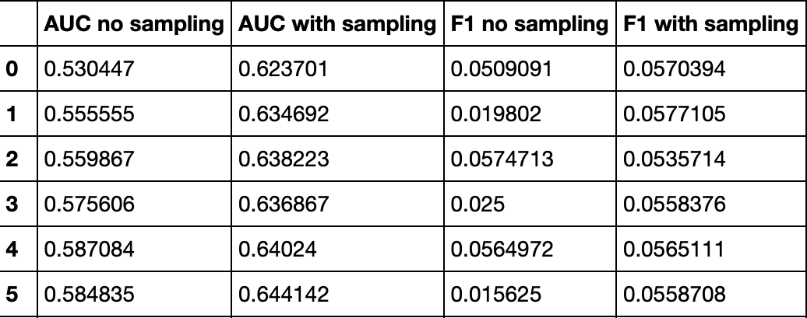
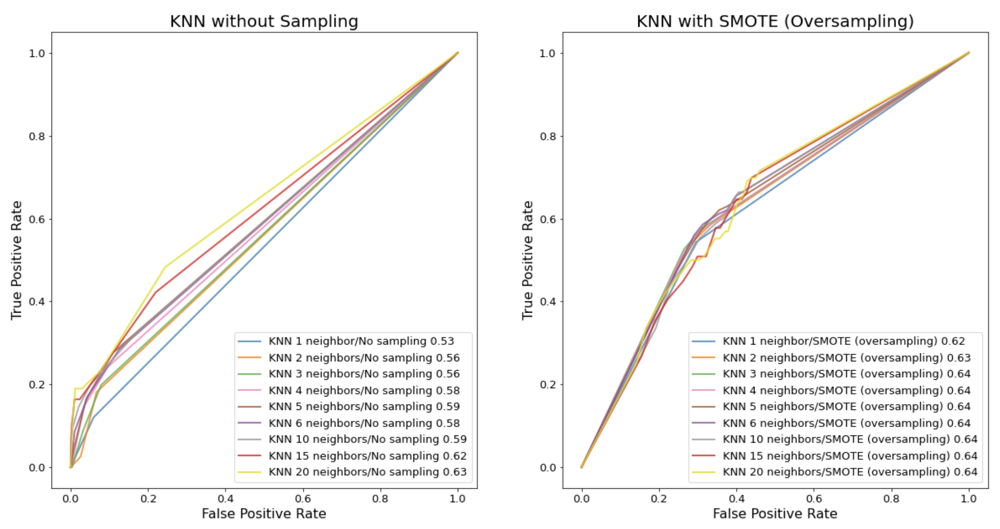
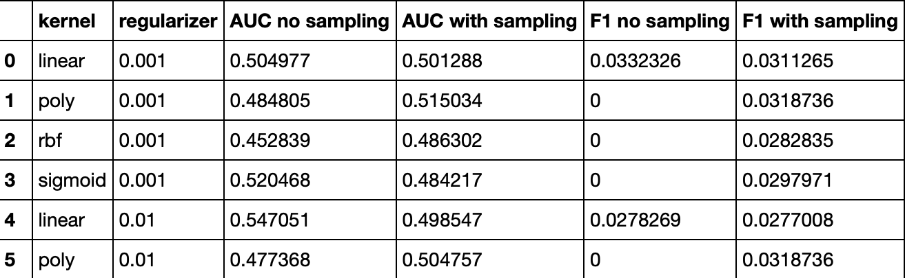
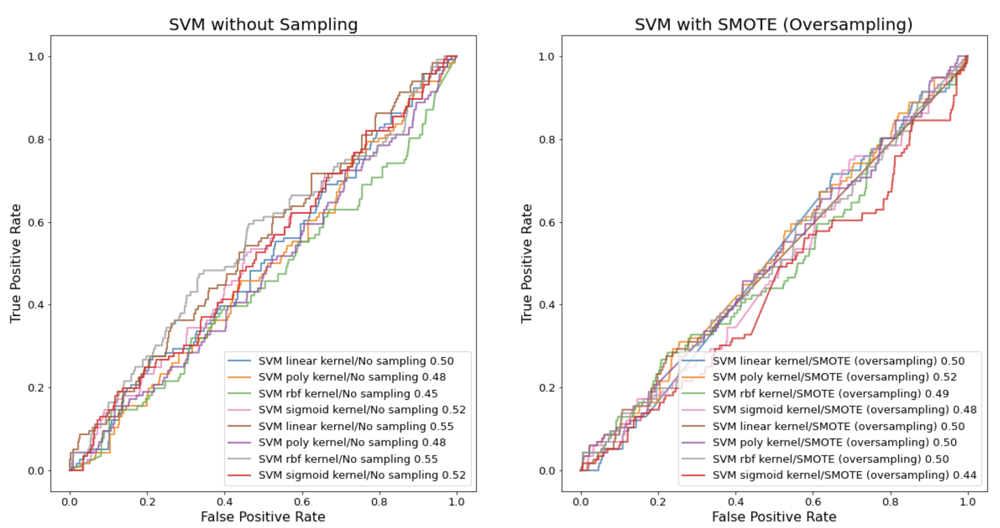
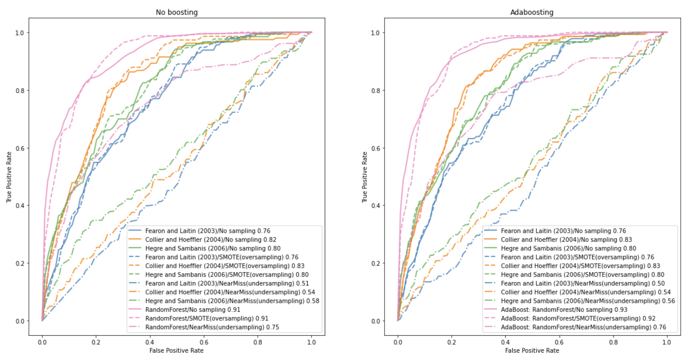
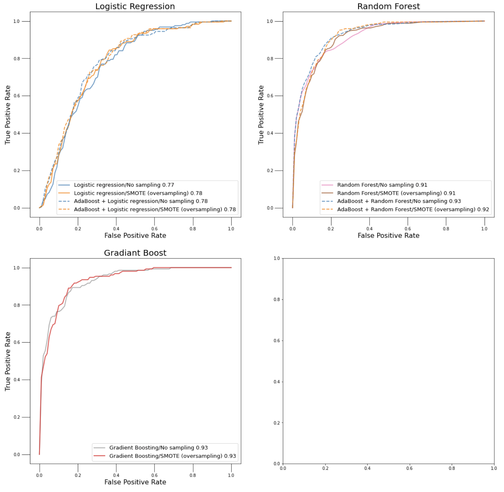

**Abstract**

In this extension, we will explore methods to overcome the unbalance in the data classes. First, we will apply data correction methods such as boosting or sampling on the same dataset used in the article, expecting to improve the logistic regression model’s accuracy. Then we will explore other classifiers aiming to get the best possible predictive results on the corrected data. Cross validation is applied here as it produces unbiased and accurate error rates. In assessing the predictive performance, we use the metrics, Confusion matrix, F1 score, Receiver Operating Characteristic Curve and AUC score.

**KNN classifier**

**SVM classifier**

**Data correction**
  **Logistic regression functions**
  
  
  
  
  
**Models with all features**

